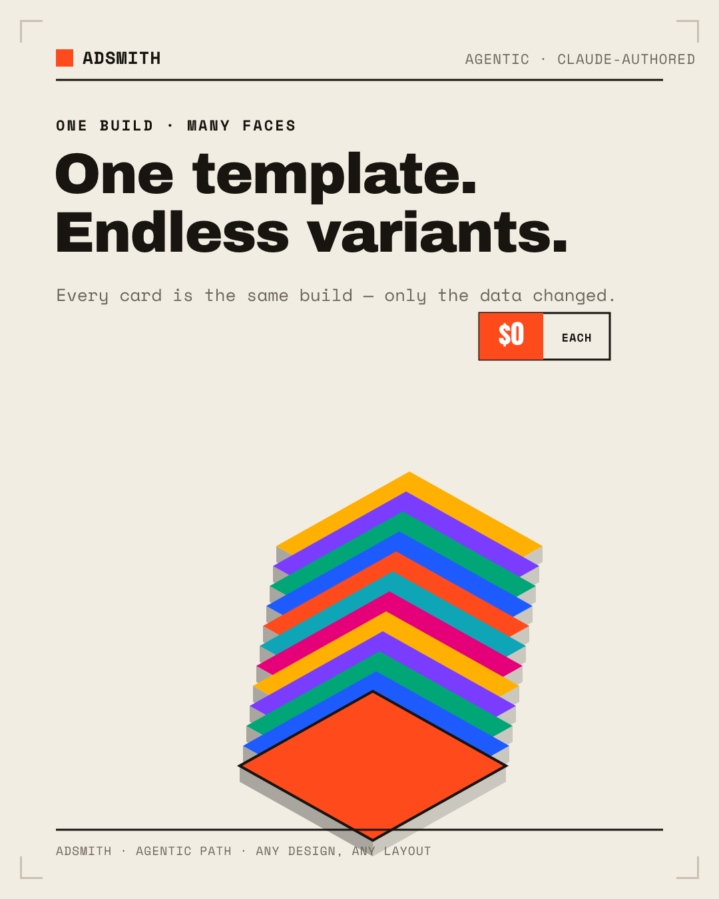
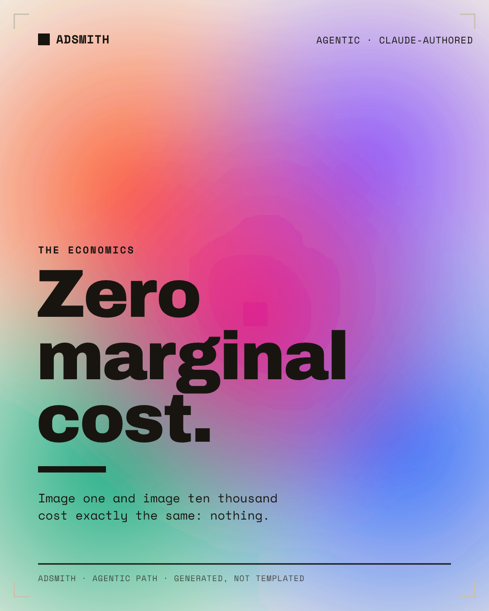
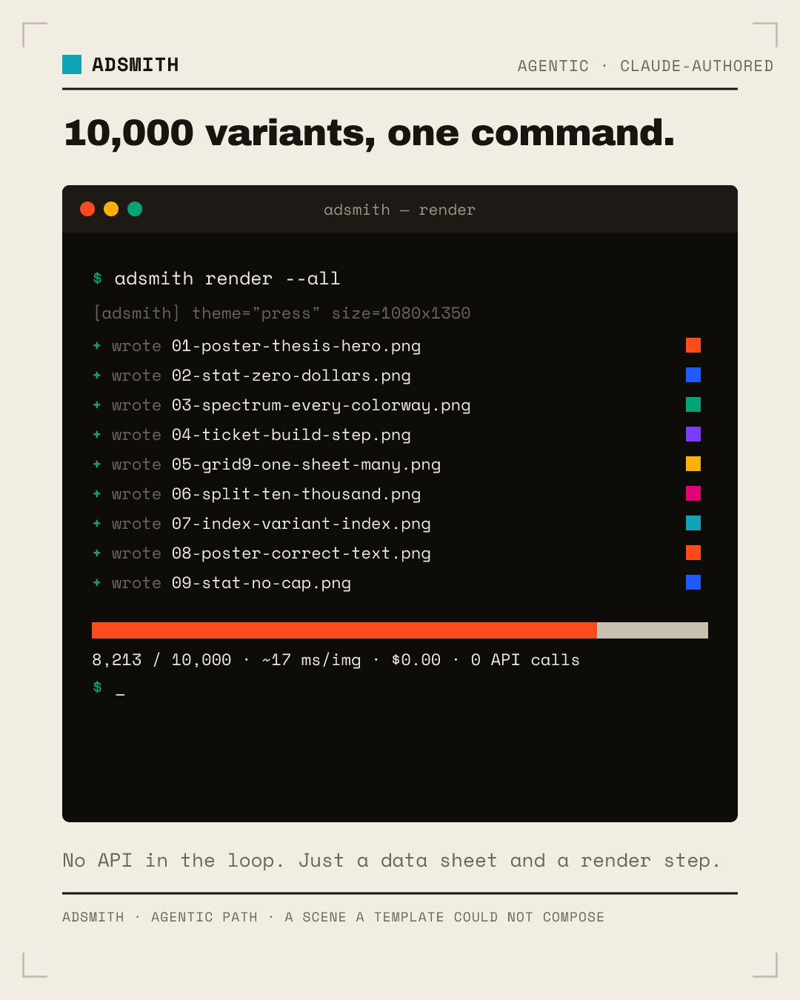
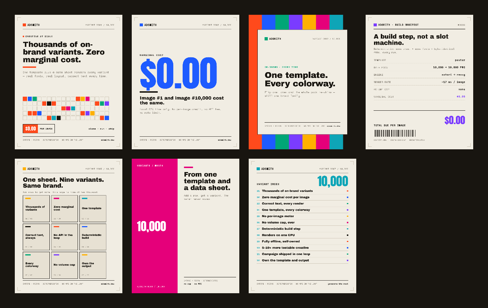

# Adsmith

**Generate thousands of on-brand creative variants at zero marginal cost.**

One template + a data sheet → hundreds or thousands of pixel-perfect, on-brand
ad / social creatives. Text always renders correctly because it's real fonts and
real CSS layout — **not** a diffusion model guessing at letterforms.

Adsmith ships **two paths** that share one rasteriser, so you can trade cost for
flexibility per creative:

| | **1 · Templates** (deterministic) | **2 · Agentic** (AI-authored) |
|---|---|---|
| Engine | data row → **Satori** → resvg | brief → **Claude** authors an SVG → resvg |
| Speed | ~30 ms/image | seconds/image |
| Cost | **$0**, no API, offline | costs tokens (one API call/image) |
| Repeatable | **byte-identical** every run | non-deterministic (cached to stabilise) |
| Ceiling | only designs you've coded as a template | **any** layout, any design level |
| Use it for | thousands of variants of a known design | bespoke art a template can't express |

The templates give you volume at zero cost. The agentic path removes the design
ceiling — it's how you build a *custom* graphics library instead of a fixed set,
even though it's slower and spends tokens. Use whichever each creative needs.

### Agentic path — designs a template can't express

These three were **authored by Claude** as complete SVGs from a one-line brief
(isometric card stack, mesh-gradient poster, faux build console). The committed
sources live in [`examples/agentic/`](examples/agentic).

<p align="center">
  
  
  
</p>

### Template path — seven distinct layouts from one data sheet

<p align="center"></p>

---

## Why this exists

Hosted creative-automation tools (Bannerbear, Creatomate, Placid, …) charge a
**per-image credit** and cap your volume. When every extra variant costs money,
you ration your A/B tests. Adsmith's template path removes the meter: the
variants are a deterministic **build step**, so you can test the long tail
without watching a counter. The agentic path then covers the designs a fixed
template can't — at a token cost you opt into, image by image.

This repo is the reference implementation of both ideas — a real, clone-and-run
project, not a screenshot.

---

## Path 1 — Templates (deterministic, $0, offline)

```bash
npm install
npm run build          # render all template variants + a contact sheet
```

or step by step:

```bash
npm run render                     # data/variants.json → out/*.png + *.svg
npm run render:carbon              # same rows, dark theme (re-skin proof)
npm run contact-sheet              # tile out/*.png → out/_contact-sheet.png
```

**What it proves**

- **Correct text, every time.** Every character is a real font's glyph outline,
  laid out by a real flexbox/CSS engine (Satori). The headline says exactly what
  you typed in `data/variants.json`, spelled correctly, every run.
- **$0 marginal cost, no cap.** No per-image fee, no rate limit. ~15–35 ms/image
  on a laptop. Image #10,000 costs the same as #1.
- **Deterministic.** Same sheet + same fonts ⇒ **byte-for-byte identical PNGs**
  (verify with `shasum`). Belongs in CI, not a slot machine.
- **Tokens-first — re-skins at once.** Colours and type live in
  `brand/theme.json`. Flip `"active": "press"` → `"carbon"` (or edit the palette)
  and every variant re-skins on the next render.

**Seven distinct layouts** ship by default; each row picks one via `"layout"`:

| Layout | What it's for |
| --- | --- |
| `poster` | Hero headline + the variant-matrix swatch field + the `$0.00` stamp. |
| `stat` | One enormous number (`$0.00`, `∞`, `17ms`) in Anton. |
| `spectrum` | The full palette as a colour band — *one template, every colorway*. |
| `ticket` | A monospace **build manifest / receipt** — each image as a $0.00 artifact. |
| `grid9` | A 3×3 **mosaic** of miniature creatives — one sheet, many faces. |
| `split` | A duotone accent/paper split around a giant numeral. |
| `index` | A **variant index** — the catalog this sheet produces. |

Add a layout file under `src/templates/`, register it in `src/templates/index.js`,
and every row can use it.

---

## Path 2 — Agentic (Claude authors any design)

Some creatives can't be expressed as a flexbox template — an isometric
illustration, a mesh-gradient poster, a faux build console. For those, describe a
**brief** and let Claude author a complete, self-contained SVG, which the same
resvg step rasterises.

```bash
npm run agentic                    # OFFLINE: render the committed, Claude-authored
                                   # examples in examples/agentic/ — no key, $0
ANTHROPIC_API_KEY=sk-… npm run agentic:live   # author fresh SVGs via Claude
```

`data/briefs.json` holds the briefs; `examples/agentic/*.svg` are the committed
outputs so `npm run agentic` shows results with no key and no cost. In live mode
each SVG is authored by `claude-opus-4-8` (streamed, adaptive thinking) and cached
under `cache/` so reruns are free and stable.

<p align="center">
  
  
  
</p>

**The trade-off, stated plainly:** the agentic path is slower and spends tokens,
and it isn't byte-deterministic. You accept that because it can produce designs
the templates simply cannot — which is the only way to build a bespoke,
ever-growing graphics library rather than a fixed one. Everything the model emits
is still real vector SVG with real text (no rasters, no external assets), so the
"correct text, real fonts" guarantee holds on this path too.

> The `@anthropic-ai/sdk` is an **optional** dependency, only needed for
> `agentic:live`. `npm run agentic` (mock) and the whole template path work
> without it. Auth follows the SDK's normal resolution (`ANTHROPIC_API_KEY` or an
> `ant auth login` profile).

---

## Make it yours

1. **Copy** — edit `data/variants.json` (templates) or `data/briefs.json`
   (agentic). Add rows/briefs to get more variants.
2. **Brand** — edit `brand/brand.json` (name, mark, url) and `brand/theme.json`
   (palette, themes). Both paths read these tokens, so the whole pack re-skins.
3. **Layout** — add a template in `src/templates/`, or a new art direction in a
   brief.

### A template data row

```json
{
  "layout": "poster",
  "eyebrow": "Creative at scale",
  "headline": "Thousands of on-brand variants. Zero marginal cost.",
  "subhead": "One template plus a data sheet renders every variant.",
  "cta": "clone · run · ship",
  "stamp": "$0.00",
  "stampSub": "PER IMAGE"
}
```

### An agentic brief

```json
{
  "id": "mesh-gradient",
  "direction": "A soft organic mesh / aurora poster over the paper, with one enormous confident statement. Generative, atmospheric — the opposite of a rigid grid.",
  "headline": "Zero marginal cost.",
  "subhead": "Image one and image ten thousand cost exactly the same: nothing."
}
```

Swap `data/variants.json` for a CSV with a two-line parser in `src/render.js` to
drive thousands of rows from a spreadsheet export.

---

## Files

| Path | Role |
| --- | --- |
| `src/render.js` | **Template engine.** Rows → Satori → resvg → `out/`. |
| `src/agentic.js` | **Agentic engine.** Briefs → Claude → resvg → `out-agentic/`. |
| `src/templates/*.js` | One file per layout. Pure `(row, tokens) → element tree`. |
| `src/components.js` | Shared motifs: variant matrix, serial counter, cost stamp, crop marks. |
| `src/tokens.js` | Loads `brand/*.json` and resolves the active theme + accent rotation. |
| `brand/brand.json` | Brand identity (name, mark, url, spec line, run total). |
| `brand/theme.json` | **Design tokens** — palette, themes, type, grid. The re-skin layer. |
| `data/variants.json` | The template data sheet (7 example rows). |
| `data/briefs.json` | The agentic briefs (3 example briefs). |
| `examples/agentic/*` | Committed, Claude-authored SVGs (+ PNG renders) for offline `agentic`. |
| `assets/fonts/*.ttf` | Bundled **static** Archivo Black, Anton, Space Mono (OFL 1.1). |
| `scripts/fetch-fonts.js` | Self-heal helper if fonts go missing. |
| `scripts/contact-sheet.js` | Tiles every template PNG into one overview image. |
| `out/`, `out-agentic/` | Committed sample outputs. |

## Font notes

Satori can't use system fonts by name — it needs a real font **buffer**, and its
bundled `opentype.js` parser doesn't reliably read every *variable*-font `fvar`
table. So Adsmith ships **static, single-weight** TTFs:

```
assets/fonts/ArchivoBlack-Regular.ttf   display / headlines
assets/fonts/Anton-Regular.ttf          giant numerals
assets/fonts/SpaceMono-Regular.ttf      labels / body (400)
assets/fonts/SpaceMono-Bold.ttf         labels / body (700)
```

All three families are SIL Open Font License 1.1 (free to redistribute); each
license sits beside the fonts as `*-OFL.txt`. If they go missing, run
`npm run fetch-fonts`.

## What this does NOT prove

- No marketing claims — no ad was served; there are no click/reply/conversion
  numbers here.
- Template layout quality is only as good as the template; very long strings can
  overflow (basic wrapping, not auto-fit).
- The agentic path costs tokens and is non-deterministic — that's the price of
  arbitrary design, and it's opt-in per image.

## How it relates to the ecosystem

The engine choice (Satori + resvg, no headless browser) follows the well-trodden
OG-image path used by Vercel. The tokens-first, "re-skin the whole deck at once"
philosophy is inspired by [slidesmith](https://github.com/theopopov/slidesmith).
Adsmith applies both specifically to the **ad/social variant** use case, and adds
an agentic authoring path for designs a template can't reach.

## License

MIT for the source. Bundled fonts retain their OFL 1.1 licenses. See [LICENSE](LICENSE).
